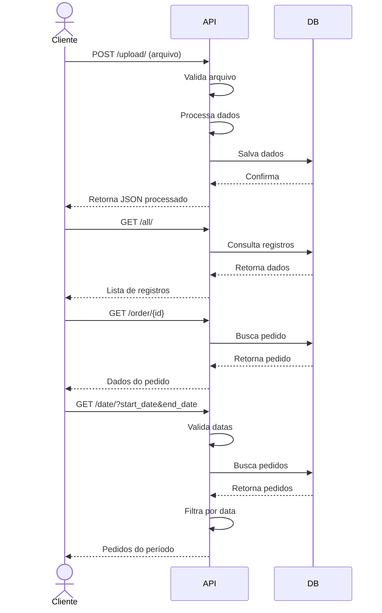

# API de Processamento de Pedidos

Este projeto é uma API REST desenvolvida em Django que recebe arquivos de pedidos desnormalizados, faz a trativa e retorna formato JSON normalizado.

## Escolha da tecnologia
A escolha pelo django é a facilidade de ser uma api escalavel, visto que se pode compartilhar o app com qualquer outra api criada em django, já vindo como nativo o banco sqlite que é facil para realizar testes, visto que para mudar o projeto para o postgres, basta realizar a alteração no settings.  

## Funcionalidades

- Upload de arquivo de pedidos desnormalizados
- Listagem de pedidos
- Busca de pedido por ID
- Busca de pedidos por período de data

## Requisitos

- Python 3.10+
- Django 5.0+
- Django REST Framework

## Passo a passo para instalar o projeto

1. Clone o repositório:
```bash
https://github.com/WesleyHs/api_desafio.git
cd api_desafio
```

2. Crie e ative uma venv ou ambiente virtual:
```bash
python -m venv .venv
source .venv/bin/activate  # Linux/Mac
# ou
.venv\Scripts\activate  # Windows
```

3. instala os pacotes e dependencias:
```bash
pip install -r requirements.txt
```
4. Execute o migrations:
```bash
python manage.py makemigrations api
```

5. Execute o migrate:
```bash
python manage.py migrate
```

5. Inicie o servidor:
```bash
python manage.py runserver
```

## Endpoints da API

### 1. Upload de Arquivo
- **URL**: `/api/v1/upload/`
- **Método**: POST
- **Descrição**: Recebe um arquivo desnormalizado e faz a tratativa

### 2. Listar Todos os Pedidos
- **URL**: `/api/v1/all/`
- **Método**: GET
- **Descrição**: Retorna todos os pedidos.

### 3. Buscar Pedido por ID
- **URL**: `/api/v1/order/<order_id>/`
- **Método**: GET
- **Descrição**: Retorna os detalhes de um pedido específico

### 4. Buscar Pedidos por Data
- **URL**: `/api/v1/date/`
- **Método**: GET
- **Parâmetros**:
  - `start_date`: Data inicial (formato YYYYMMDD)
  - `end_date`: Data final (formato YYYYMMDD)
- **Descrição**: Retorna pedidos dentro do período especificado

## Exemplo de Uso

1. Upload de arquivo:
```bash
curl -F "file=@/caminhodoarquivo/pedidos.txt" localhost:8000/api/v1/upload/
```
2. Usando o Postman:
- Abra o Postman
- Requisição POST para `http://localhost:8000/api/v1/upload/`
- No body, selecione form-data
- Adicione uma chave com file
- Selecione File no canto esquerdo da chave
- Selecione o arquivo que deseja enviar
- Clique em Send para fazer o upload

3. Listar todos os pedidos:
```bash
  Requisição GET para `http://localhost:8000/api/v1/all/`
```

4. Listar por pedido:
```bash
  Requisição GET para `http://localhost:8000/api/v1/order/<order_id>/`
```

5. Buscar pedidos por data:
```bash
curl "http://localhost:8000/api/v1/date/?start_date=20210101&end_date=20210131"
```
## Testes

O projeto inclui testes automatizados para todas as funcionalidades. Para executar os testes:

```bash
python manage.py test api.tests
```
